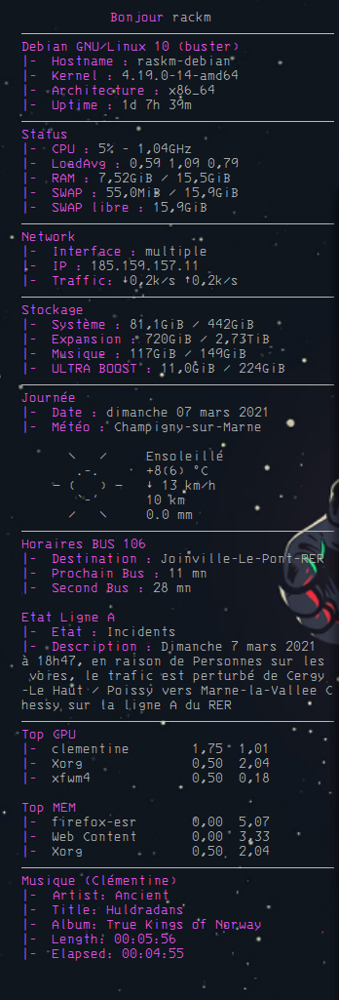

# RaskmConky

## Screenshot

## Personnalisation

xinerama_head = 1, (Modifier l'écran sur lequel s'affiche le thème Conky, pour les multi écrans). 
alignment = 'top_right', (Emplacement du thème sur l'écran). 
font = 'IBM 3270:size=13', (Police disponible ici : https://github.com/rbanffy/3270font). 
Dans stockage, modifier vos emplacement en fonction de votre ordinateur. 
Dans le réseau, modifier le nom de votre interface réseau, pour moi c'est enp3s0. 
Pour la météo, modifier la ligne wttr.in/Champigny-sur-Marne?0qT&lang=fr  
Pour Clémentine, modifier l'emplacement du script Python en fonction de votre chemin d'accès. 
 
Merci à Amish Naidu pour le script Python permettant l'intégration de Clémentine.
